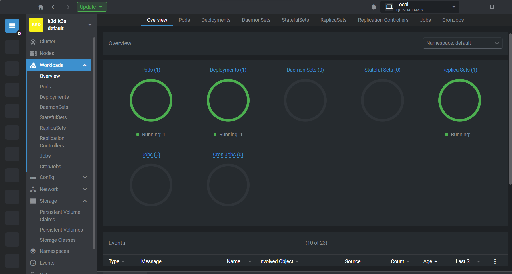

# kube-random-hash
NodeJS app that returns a string hash and deploys it in kubernetes pod replicas.

You can inspect your app in Lens Kubernetes IDE:


## Steps to execute
If you clone the code start the kube like this:
```
kubectl apply -f .\manifests\deployment.yaml 
```

Otherwise link directly to this repo:
```
kubectl apply -f https://raw.githubusercontent.com/quindai/kube-random-hash/main/manifests/deployment.yaml 
```

You should get 
```bash
deployment.apps/hashgenerator-dep created
```

Visualize you kube running:
```
kubectl describe deployment hashgenerator-dep
```

Extract the NewReplicaSet variable and visualize the pod:
```
kubectl describe pod hashgenerator-dep-59876bb5fb
...

Events:
  Type    Reason     Age   From               Message
  ----    ------     ----  ----               -------
  Normal  Scheduled  49s   default-scheduler  Successfully assigned default/hashgenerator-dep-59876bb5fb-6vrf2 to k3d-k3s-default-agent-0
  Normal  Pulling    49s   kubelet            Pulling image "quindai/kube_random:latest"
  Normal  Pulled     47s   kubelet            Successfully pulled image "quindai/kube_random:latest" in 1.559150007s
  Normal  Created    47s   kubelet            Created container hashgenerator
  Normal  Started    47s   kubelet            Started container hashgenerator
```


Delete the kube:
```
kubectl delete -f .\manifests\deployment.yaml 
```